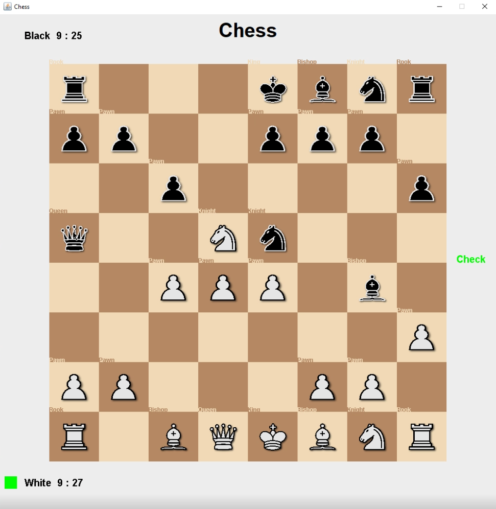
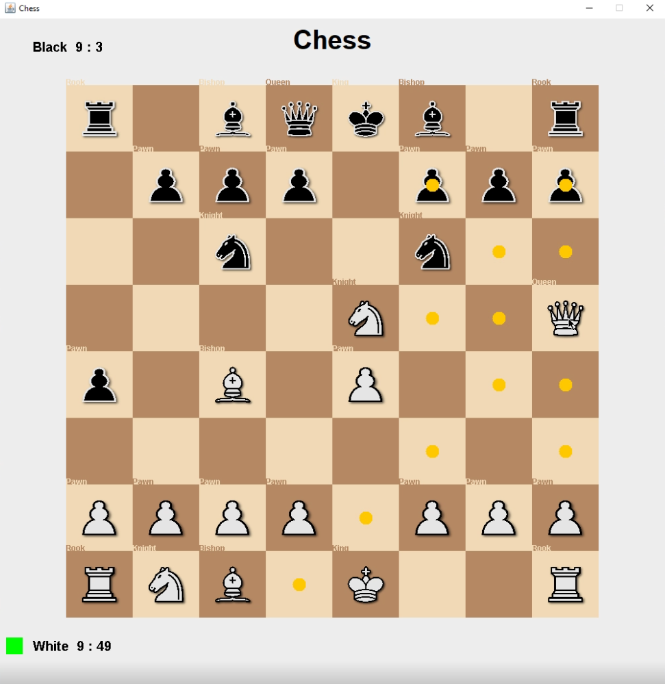

# Chess

This is a simple chess game implemented using Java Swing utilities. The game has been developed from scratch and allows players to play a classic game of chess on the graphical user interface.

## Running the Executable

To quickly test the game, you can use the provided executable file:
Locate the `Chess.exe` file in the folder: `out/artifacts/Chess_jar/Chess.exe`.

Please note that the executable is platform-specific and is intended to run on Windows systems.

For Linux users, follow these steps to run the game using the provided JAR file:

1. Open a terminal.
2. Locate the `Chess.jar` file in the folder: `out/artifacts/Chess_jar/Chess.jar`.
3. Run the following command to start the game: java -jar Chess.jar

## Features

* Player vs. Player mode: Two players can take turns making their moves.
* Classic chess rules: The game follows the standard rules of chess, including piece movements, captures, castling, enpassant, check, and checkmate.
* Legal move validation: The game ensures that only valid moves are allowed and enforces the rules of chess.
* Highlight legal moves: When a player selects a piece, the game highlights the legal moves for that piece to assist in gameplay.
* Simple GUI: The graphical user interface is built using Swing, providing an intuitive and easy-to-use interface.

## Screenshots

### Check Example

### Legal Moves for the Queen

